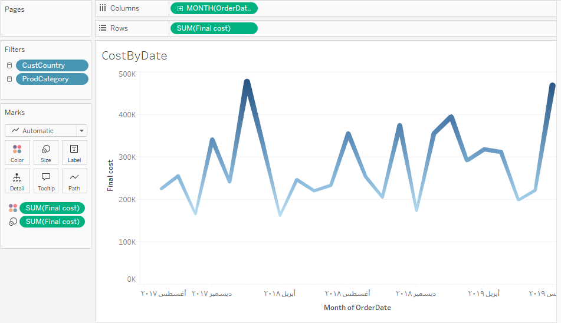

# Sales-Analysis-and-Dashboard
In this project, I utilized Tableau Public to create an interactive sales dashboard designed for insightful business decision-making. I conducted analysis of an e-commerce dataset containing 4,976 rows of order details. The dataset includes order numbers, dates, customer types, product categories, quantities, prices, discounts, and total costs. The goal of this analysis was to extract valuable insights into sales performance, customer behavior, and product effectiveness.

#### If you want to see the dynamic dashboard, visit my Tableau Public profile [here](https://public.tableau.com/views/Book1_17275457178010/Dashboard1?:language=en-US&:sid=&:redirect=auth&:display_count=n&:origin=viz_share_link)

## Dashboard Features
### Overall Dashboard

### Orders by Product Category
Displayed as a horizontal bar chart to highlight the volume of orders by product type.

### Orders by Order Type
Visualized using a pie chart to show the distribution of retail vs. wholesale orders.

### Final Cost by Product Category
Represented with a treemap to easily identify the contribution of each category to overall revenue.

### Orders by Country
Illustrated on a symbol map to provide geographical context for sales.

### Cost by Order Date
Shown through a line chart to analyze trends over time.

### I made the dashboard fully dynamic by applying filters that allow users to interact with all visual elements simultaneously. This ensures an intuitive and engaging experience for exploring the data.

#### If you want to see the dynamic dashboard, visit my Tableau Public profile [here](https://public.tableau.com/views/Book1_17275457178010/Dashboard1?:language=en-US&:sid=&:redirect=auth&:display_count=n&:origin=viz_share_link)

Data Visualization: Created various types of charts to represent sales data effectively.

Dashboard Design: Designed an interactive, multi-chart dashboard for better sales analysis.

User Interaction: Applied filters and dynamic interactions to create a cohesive and engaging experience for users exploring the sales data.

This project showcases my ability to use Tableau Public to transform raw data into actionable insights through visually compelling dashboards, providing stakeholders with an in-depth understanding of sales patterns and trends.

## Data Source

I have included the dataset used for this project. You can download the Excel file [here](https://github.com/Israa-Idris/Sales-Analysis-and-Dashboard/raw/refs/heads/main/Sales.xlsx).

Feel free to explore the data for deeper insights!

### Dataset Overview

The dataset contains the following key columns:
- **Order Number**
- **Order Date**
- **Customer Type**
- **Product Category**
- **Price**
- **Quantity**
- **Final Cost**

  ## Sample Data

Here is a sample of the dataset used for this project:

| OrderNum | OrderDate   | OrderType | CustomerType | CustName              | CustCountry | CustCity                     | ProdCategory   | ProdNumber | ProdName                      | Quantity | Price   | Discount | Total Cost |
|----------|-------------|-----------|--------------|-----------------------|-------------|------------------------------|-----------------|------------|-------------------------------|----------|---------|----------|------------|
| 1100934  | 01/09/2017  | Wholesale  | Business      | Gusikowski Group      | Morocco     | Douar Oulad Amer Leqliaa     | Blueprints       | BP102      | Bsquare Robot Blueprint        | 10       | $8.99   | $1.80    | $88.10     |
| 1100935  | 01/09/2017  | Retail     | Individual    | Spencer Educators     | Syria       | Jindayris                    | Drone Kits       | DK204      | BYOD-300                      | 2        | $89.00  | 0        | $178.00    |
| 1100936  | 01/09/2017  | Wholesale  | Business      | Schinner Inc.        | Morocco     | Ksar Lmajaz                  | Training Videos   | TV801      | Aerial Security                | 10       | $36.99  | $7.40    | $362.50    |
| 1100937  | 01/09/2017  | Retail     | Individual    | Saxon Laviss         | Morocco     | Mzefroune                    | Robot Kits       | RK602      | BYOR-1000                     | 1        | $189.00 | 0        | $189.00    |

